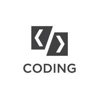

## Introduction

Hi, I'm Tristan Theart 👋
Welcome to my GitHub repository! I'm passionate about coding, problem-solving, and creating innovative solutions. As a coder, I believe in the power of collaboration and open-source contributions to drive positive change in the tech community.

## About Me
I'm a South African-based developer with expertise in Kotlin. My journey in the world of coding started 4 years ago, and since then, I've been on a continuous quest to expand my knowledge and skills.

## What You'll Find Here
In this corner of the GitHub universe, you'll discover a collection of projects and code snippets that reflect my interests, learning experiences, and contributions to the community. Whether it's a small utility script or a larger-scale project, each piece of code has a story behind it.

## Let's Connect!
I'm always excited to connect with fellow developers, tech enthusiasts, and anyone passionate about creating a positive impact through code. Feel free to explore my projects, share your thoughts, and reach out for collaboration or just a friendly chat.

Happy coding! 🚀
